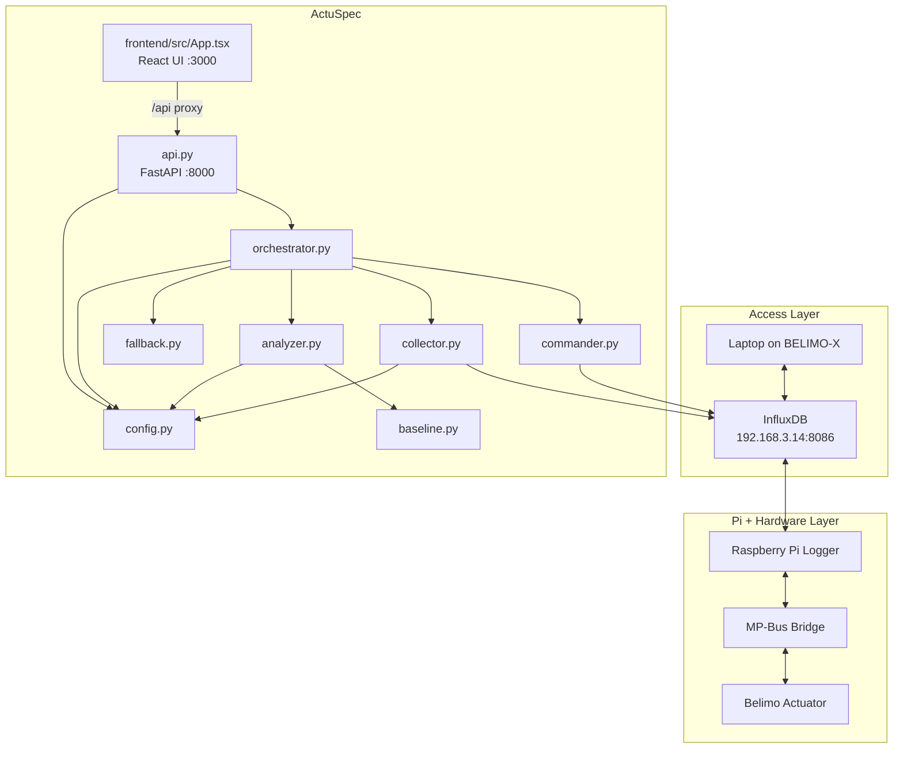
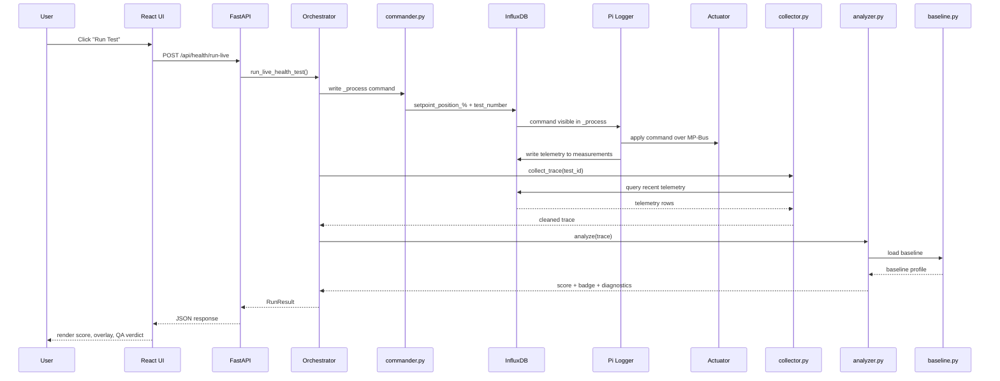

# CLAUDE.md — ActuSpec Final Architecture
## START Hack 2026 · Belimo Smart Actuators
**Repo final architecture**

---

## 1. Project identity

**Product name:** ActuSpec
**Tagline:** *We gave actuators an ECG.*

**One-line description:**
ActuSpec is a live actuator commissioning and diagnostics tool that turns torque, position, temperature, and related telemetry into a mechanical fingerprint, a health score, and a commissioning verdict.

**Primary user:**
Installer / system integrator

**Primary workflow:**
Run a controlled actuator stroke → capture telemetry → compare against healthy baseline → generate diagnosis

---

## 2. Architecture decision

### Final architecture choice
**React + FastAPI with modular Python backend**

The frontend is a React SPA (Vite + Tailwind + Recharts) that communicates with a FastAPI backend (`api.py`). The backend exposes all analysis, orchestration, and InfluxDB logic as REST endpoints. A legacy Streamlit UI (`solution.py`) exists but is **not the primary UI**.

### What it is
- React frontend served by Vite dev server (port 3000)
- FastAPI backend (port 8000) exposing REST API
- Vite proxies `/api` requests to FastAPI
- Modular Python backend: orchestrator, commander, collector, analyzer, baseline, fallback
- Prerecorded replay traces for offline demo

### What it is not
- not microservices
- not event-driven infrastructure
- not heavy ML
- not production-grade backend complexity
- not direct actuator-control software

---

## 3. System access model

### Network access
The laptop connects to the Raspberry Pi hotspot:

- **SSID:** `BELIMO-X`
- **Password:** `raspberry`

`X` is the digit shown on the Raspberry Pi label.

### InfluxDB access
All live interactions go through InfluxDB:

- **URL:** `http://192.168.3.14:8086`
- **Username:** `pi`
- **Password:** `raspberry`

### Important system reality
ActuSpec does **not** communicate with the actuator directly.

The actual live path is:

1. ActuSpec writes commands into InfluxDB measurement `_process`
2. The Raspberry Pi logger reads those commands
3. The Raspberry Pi logger applies them to the actuator over MP-Bus
4. The Raspberry Pi logger writes actuator telemetry into measurement `measurements`
5. ActuSpec reads telemetry from `measurements` and analyzes it

The Raspberry Pi logger is the real hardware bridge.
ActuSpec is a diagnostics and interaction layer on top of that pipeline.

---

## 4. Core architectural principles

1. **Replay mode is first-class, not backup polish**
   The app must work even if live hardware interaction fails.

2. **Separation of frontend and backend**
   React handles UI/UX; FastAPI handles data, analysis, and InfluxDB interaction.

3. **Analysis must be deterministic and explainable**
   Rule-based logic beats fragile sophistication.

4. **UI must show one clear story**
   Healthy baseline vs current run, plus a clear verdict.

5. **Live mode is an upgrade, not a dependency**
   The demo should still survive if command writing or telemetry timing becomes unreliable.

6. **InfluxDB is the only required live interface**
   The architecture assumes no direct SSH, serial, or MP-Bus control from the laptop.

7. **Useful traces must be preserved locally**
   Pi-side data is not persistent across reboots, so baselines and replay traces must be saved on the laptop.

---

## 5. Final file structure

```text
Belimo_hack/
├── CLAUDE.md
├── README.md
├── requirements.txt
├── api.py               # FastAPI backend — REST endpoints for frontend
├── solution.py           # Legacy Streamlit UI (not primary)
├── orchestrator.py       # run-state coordination
├── commander.py          # InfluxDB _process command writer
├── collector.py          # InfluxDB measurements trace retrieval
├── analyzer.py           # metrics, scoring, rules, diagnosis
├── baseline.py           # healthy baseline loading/comparison
├── fallback.py           # prerecorded trace loading + local persistence
├── charts.py             # Altair plotting helpers (used by Streamlit)
├── config.py             # field names, thresholds, constants
├── data/
│   ├── baseline_healthy.json
│   ├── replay_healthy.json
│   ├── replay_fault.json
│   └── replay_commissioning.json
└── frontend/
    ├── package.json
    ├── vite.config.ts        # dev server on :3000, proxies /api → :8000
    ├── tailwind.config.js
    ├── tsconfig.json
    └── src/
        ├── App.tsx           # Main React UI — all tabs and views
        ├── main.tsx          # React entry point
        ├── index.css         # Global styles (Tailwind)
        ├── api/client.ts     # API client — all fetch calls to FastAPI
        ├── types.ts          # TypeScript type definitions
        ├── components/ui.tsx # Reusable UI components (Card, Badge, Button)
        └── lib/utils.ts      # cn() utility
```

---

## 6. How to run

### Frontend (primary UI)
```bash
cd frontend
npm install
npm run dev
```
Opens at `http://localhost:3000`.

### Backend (must be running for frontend to work)
```bash
python -m pip install -r requirements.txt
python -m uvicorn api:app --host 0.0.0.0 --port 8000
```

### Legacy Streamlit UI (optional, standalone)
```bash
python -m streamlit run solution.py
```

---

## 7. Responsibilities of each module

### `api.py`
**Role:** FastAPI REST backend

**Responsibilities:**
- Expose all orchestration, analysis, and data logic as REST endpoints
- Serialize pandas DataFrames/Series to JSON
- CORS enabled for frontend dev server
- 25+ endpoints covering: state, telemetry, commands, baseline, health, commissioning, fleet, replay, config

### `frontend/src/App.tsx`
**Role:** Primary React UI

**Responsibilities:**
- 4-tab navigation: Operations Deck, Baseline Lab, Health Intelligence, Commissioning Gate
- Live/Replay mode toggle
- Recharts-based interactive charts
- Real-time telemetry polling
- All API calls go through `api/client.ts`

### `frontend/src/api/client.ts`
**Role:** API client layer

**Responsibilities:**
- All fetch calls to FastAPI backend
- Typed request/response handling
- Uses `/api` prefix (Vite proxies to `:8000`)

### `orchestrator.py`
**Role:** central run coordinator

**Responsibilities:**
- maintain run state: `idle` → `commanding` → `collecting` → `analyzing` → `done` / `error`
- prevent multiple simultaneous runs
- coordinate: commander → collector → analyzer → fallback
- return final result payload

### `commander.py`
**Role:** InfluxDB `_process` command writer

**Responsibilities:**
- write command rows into measurement `_process`
- send `setpoint_position_%` and `test_number`
- uses epoch-timestamp convention

**Important note:**
This module does **not** control the actuator directly.
The Raspberry Pi logger reads `_process` and applies commands to the actuator over MP-Bus.

### `collector.py`
**Role:** telemetry acquisition from `measurements`

**Responsibilities:**
- query InfluxDB measurement `measurements`
- load recent telemetry window
- extract the relevant run trace
- validate required fields

### `analyzer.py`
**Role:** scoring + diagnosis engine

**Responsibilities:**
- torque profile computation
- health score (RMS deviation vs baseline)
- health diagnosis (deterministic text templates)
- commissioning score (range, CV, tracking, temperature checks)

This module must be deterministic and explainable.

### `baseline.py`
**Role:** healthy reference manager

### `fallback.py`
**Role:** replay trace provider and local trace persistence

### `charts.py`
**Role:** Altair plotting helpers (used by legacy Streamlit UI)

### `config.py`
**Role:** central constants and environment mapping

---

## 8. Runtime modes

### Mode A — Live
Used when:
- laptop is connected to `BELIMO-X`
- InfluxDB is reachable
- command writing to `_process` works
- telemetry arrives correctly in `measurements`

**Flow:**
1. User clicks **Run Live Test** in React UI
2. React calls FastAPI endpoint
3. FastAPI → Orchestrator → Commander writes to `_process`
4. Raspberry Pi logger applies commands to actuator over MP-Bus
5. Orchestrator → Collector pulls telemetry from `measurements`
6. Orchestrator → Analyzer compares against baseline
7. FastAPI returns JSON result
8. React renders score, overlay, badge, diagnosis

### Mode B — Replay
Used when:
- live command path fails
- demo reliability must be guaranteed
- the Pi bucket has been reset

**Flow:**
1. User selects prerecorded scenario in React UI
2. React calls replay endpoint
3. FastAPI → Fallback loader loads locally saved trace
4. Analyzer runs unchanged
5. React renders same outputs as live mode

Replay mode is a **core feature**, not an apology.

---

## 9. UI structure (React)

### Tab 1 — Operations Deck
- Live/Replay mode toggle
- Manual actuator control (send setpoints)
- Live telemetry charts
- Run state indicator

### Tab 2 — Baseline Lab
- Certified healthy baseline profile
- Run/load baseline actions
- Baseline overlay chart

### Tab 3 — Health Intelligence
- Health score 0–100
- Baseline vs current overlay
- Diagnostic explanations
- Fleet intelligence bar chart

### Tab 4 — Commissioning Gate
- Pass / marginal / fail badge
- Check breakdown (range, torque CV, tracking error, temp rise)
- Recommendations

---

## 10. Data model assumptions

### InfluxDB connection
- **Bucket:** `actuator-data`
- **Telemetry measurement:** `measurements`
- **Command measurement:** `_process`

### Telemetry fields in `measurements`
- `feedback_position_%`
- `setpoint_position_%`
- `motor_torque_Nmm`
- `internal_temperature_deg_C`
- `power_W`
- `rotation_direction`
- `test_number`

### Command fields in `_process`
- `setpoint_position_%`
- `test_number`

### Timestamp handling
- command writes use epoch-timestamp convention
- Pi-side clock may not be calibrated; use `test_number` and relative ordering for trace extraction

---

## 11. Main analysis logic

### Healthy baseline comparison
- Bin |torque| by position (20 bins)
- Compare baseline vs current profile via RMS deviation
- Score 0–100

### Commissioning checks
1. **Range of motion** (min 60%, -30 penalty)
2. **Torque variability** (CV ≤ 1.5, -25 penalty)
3. **Tracking error** (≤ 10%, -20 penalty)
4. **Temperature rise** (≤ 5°C, -15 penalty)

Pass ≥ 70, Marginal ≥ 50, Fail < 50

### Diagnostic explanations
Deterministic text templates — no vague AI-style explanations.

---

## 12. Architecture diagram



---

## 13. Sequence diagram



---

## 14. Tech stack

### Backend (Python)
```txt
fastapi
uvicorn
influxdb-client
pandas
numpy
scipy
altair
streamlit    # legacy UI only
```

### Frontend
- React 19 + TypeScript
- Vite (dev server + bundler)
- Tailwind CSS
- Recharts (interactive charts)
- Lucide React (icons)
- Motion (Framer Motion animations)

---

## 15. Fallback and persistence policy

### Replay policy
Replay mode must always be ready before the final demo.

### Local persistence policy
Because the Pi bucket is not persistent across reboots:
- export healthy baseline traces locally
- export at least one healthy live trace locally
- export at least one degraded/faulted trace locally
- store replay scenarios in `data/`

---

## 16. Pitch Narrative
**One-liner**: "We gave HVAC actuators an ECG."

**Target users**: Installers (commissioning badge), facility managers (health score alerts), system integrators (fleet intelligence).

**Business model**: SaaS subscription per device — bolt-on to Belimo's existing Cloud/IoT ecosystem.

---

## 17. Important Notes
- Data does NOT persist across Pi reboots — export data locally if needed
- Sampling rate is as fast as possible (no fixed period)
- Do NOT spam commands at very high rates
- Keep setpoint within 0–100
- Do NOT stick fingers in valve/damper openings
