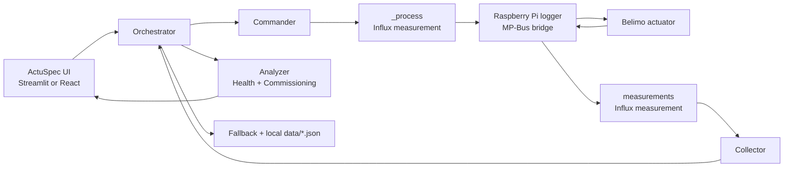

# ActuSpec

**Actuator diagnostics and commissioning intelligence for the Belimo Smart Actuators hackathon.**

ActuSpec turns raw actuator telemetry into decisions: a health score, an installation QA verdict, and a repeatable commissioning workflow.

The core idea is simple: treat an actuator torque curve like a mechanical fingerprint, compare it to a known-healthy baseline, and make the result actionable for installers and operators.

```bash
# Fastest path (replay-first demo)
pip install -r requirements.txt
streamlit run solution.py
```

## Why this matters

Belimo actuators already emit high-value signals (torque, position, temperature, power), but that data is often underused during commissioning and maintenance.

ActuSpec closes that gap by providing:

- Fast, explainable health scoring against a healthy reference
- Automatic commissioning checks with a pass/marginal/fail verdict
- Live monitoring when hardware is available
- Replay mode when hardware or network is unreliable

## Solution overview

ActuSpec is a modular Python + frontend system with two operating modes:

- `Live mode`: command and observe a real actuator through the Belimo InfluxDB setup
- `Replay mode`: run the same analytics on local traces for stable demos and fallback

It is built around the real Belimo hackathon data contract:

- Commands are written to InfluxDB measurement `_process`
- Telemetry is read from InfluxDB measurement `measurements`
- A Raspberry Pi logger bridges InfluxDB and the physical actuator over MP-Bus

## Core features

- Mechanical health score (0-100) from torque-profile deviation vs baseline
- Deterministic diagnostics (friction pattern, localized obstruction, tracking issues)
- Commissioning QA with four checks: range of motion, torque variability, tracking error, temperature rise
- Healthy baseline workflow (`test_number=999`) and baseline export to local JSON
- Fleet-style cross-test scoring for comparative context
- Replay scenarios (`healthy`, `fault`, `commissioning`) for pitch reliability
- Premium UI layer (`FastAPI + React`) plus all-in-one Streamlit app
- Local trace persistence to survive Pi-side data loss/reboots

## Architecture overview



**Important:** laptop applications do not command the actuator directly. Commands flow through `_process`, then the Pi logger applies them over MP-Bus.

## System workflow

1. User action starts a run from Streamlit or React UI.
2. Orchestrator enters `commanding` state and sends setpoints via `commander.py`.
3. Commands are written to `_process` with a fixed epoch timestamp and `test_number` tag.
4. Pi logger consumes commands and drives the actuator over MP-Bus.
5. Pi logger continuously writes actuator telemetry into `measurements`.
6. `collector.py` queries telemetry and normalizes it.
7. `analyzer.py` computes health score or commissioning verdict.
8. Results are shown in UI and can be exported to local `data/*.json`.

## Repository structure

```text
.
|-- solution.py                 # Streamlit demo app (single-process UI)
|-- api.py                      # FastAPI backend for premium frontend
|-- orchestrator.py             # Run state machine + pipeline coordination
|-- commander.py                # Writes setpoints to _process
|-- collector.py                # Reads telemetry from measurements
|-- analyzer.py                 # Health/commissioning algorithms + diagnostics
|-- baseline.py                 # Baseline load/save/profile management
|-- fallback.py                 # Replay loading + local trace persistence
|-- config.py                   # Influx config, thresholds, sequences
|-- frontend/                   # React + Vite premium UI layer
|-- data/                       # Baseline and replay traces
|-- requirements.txt
|-- README.md
```

## Setup and installation

### Prerequisites

- Python 3.10+
- Node.js 18+ (only for premium frontend)
- Access to Belimo hackathon bench for live mode

### Install backend dependencies

```bash
pip install -r requirements.txt
```

### Optional: install frontend dependencies

```bash
cd frontend
npm install
cd ..
```

### Configure Influx connection (if needed)

ActuSpec ships with Belimo-hackathon defaults in `config.py`. If your station differs, update:

- `INFLUX_URL`
- `INFLUX_TOKEN`
- `INFLUX_ORG`
- `INFLUX_BUCKET`

## Connect to the Belimo setup (live mode)

1. Connect your laptop to the Belimo Wi-Fi (`BELIMO-X`, password commonly `raspberry` in hackathon setup).
2. Open InfluxDB UI at `http://192.168.3.14:8086`.
3. Verify bucket `actuator-data` receives fresh rows in measurement `measurements`.
4. Confirm `_process` writes are accepted when sending a command from ActuSpec.

If `measurements` is not updating, the Pi logger / actuator path is down, and replay mode should be used.

## Run the app

### UI stack (FastAPI + React)

Terminal 1:

```bash
uvicorn api:app --reload --host 0.0.0.0 --port 8000
```

Terminal 2:

```bash
cd frontend
npm run dev
```

Open `http://localhost:3000`.

Vite proxies `/api` to `http://127.0.0.1:8000`.

## Live mode vs Replay mode

| Mode | Data source | Commands | Use case |
|---|---|---|---|
| `Live` | Influx `measurements` from Pi logger | Writes to `_process` | Real hardware validation |
| `Replay` | Local `data/*.json` traces | No hardware writes | Reliable demo fallback |

Replay mode is intentional, not a placeholder. It guarantees deterministic demo behavior when Wi-Fi, Pi services, or bench hardware are unstable.

## Belimo data-flow specifics

### Write path (`_process`)

- Measurement: `_process`
- Key fields: `setpoint_position_%`, `test_number`
- Writer: `commander.py`

### Read path (`measurements`)

- Measurement: `measurements`
- Key fields: `feedback_position_%`, `setpoint_position_%`, `motor_torque_Nmm`, `internal_temperature_deg_C`, `power_W`, `rotation_direction`, `test_number`
- Reader: `collector.py`

### Why local persistence matters

In this hackathon setup, Pi-side data can be lost after reboot. ActuSpec supports local trace export (`data/`) so baseline and demo-critical traces remain available.

## Baseline and test-number conventions

| Test number | Meaning |
|---|---|
| `999` | Healthy baseline reference |
| `1-100` | Field health tests |
| `200-300` | Commissioning tests |
| `-1` | Default/manual tag |

Baseline can be built in live mode using orchestrated sequences (`free`, `loaded`, `stall`) and then exported locally as `data/baseline_healthy.json`.

## Demo story (judge-ready)

1. Load baseline profile and explain it as the healthy mechanical fingerprint.
2. Run health scoring on replay `healthy` and show a high score.
3. Run health scoring on replay `fault` and show score drop + localized anomaly explanation.
4. Run commissioning analysis and show PASS/MARGINAL/FAIL with check breakdown.
5. If hardware is stable, switch to live mode and send a setpoint to show real telemetry loop.

## Why this project is strong

- Uses real Belimo workflow instead of a synthetic control path
- Keeps algorithms explainable and inspection-friendly
- Designed for demo resilience with live and replay parity
- Separates orchestration, data access, analysis, and UI concerns cleanly
- Delivers both product narrative and implementation credibility

## Limitations and scope choices

- Current scoring is deterministic and threshold-based, not ML-trained.
- Baseline handling is local-file centric (`data/baseline_healthy.json`).
- No authentication layer on API endpoints (hackathon scope).
- Fleet analysis is cross-test, not a production multi-site pipeline.

## Future improvements

- Model-specific baseline registry with versioning
- Automatic baseline quality checks before certification
- Time-series drift tracking and trend alerts
- Role-based API auth + audit logs
- Cloud sync for multi-building fleet analytics
- Deeper fault taxonomy and recommendation engine

## Team and credits

Built by Team ActuSpec for the Belimo Smart Actuators challenge at START Hack 2026.

Credits:

- Belimo hackathon hardware + MP-Bus/Influx setup
- Open-source stack: Streamlit, FastAPI, React, Vite, Pandas, NumPy, Altair
